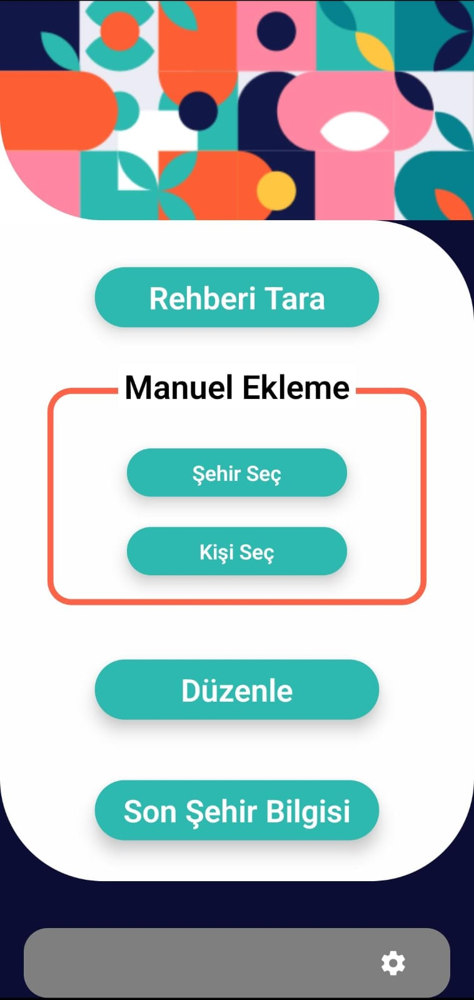
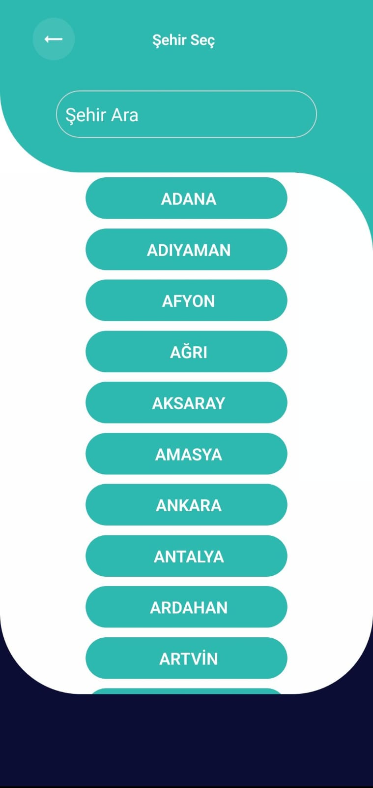

# CityConnect

CityConnect, kullanıcıların telefon rehberindeki kişi isimlerinde şehir adları geçen kişileri belirleyerek düzenlemelerine olanak tanır. Konum değiştikçe ilgili şehirdeki kişilere hızlıca erişim sağlar.

## 🚀 Özellikler

- 🌍 **Konum Tabanlı Bildirimler**: Şehir değiştirildiğinde bildirim gönderilir.
- 📞 **Rehber Senkronizasyonu**: Rehberdeki şehir isimlerini tarayarak kişileri ekler.
- 📂 **Yerel JSON Depolama**: Tüm veriler cihaz içinde saklanır, internet bağlantısı gerekmez.
- 🛠 **İzin Yönetimi**: Kullanıcı gerekli izinleri Ayarlar ekranından yönetebilir.
- 🌟 **Şehir Destekleri**: Türkiye’deki tüm şehirler desteklenmektedir.

## 📚 Kurulum

Bu projeyi çalıştırmak için aşağıdaki adımları takip edin:

1. **Gerekli Bağımlılıkları Yükleyin**

```sh
npm install
```

2. **Uygulamayı Çalıştırın**

```sh
npx react-native run-android
```

## 📸 Ekran Görüntüleri

| Ana Ekran                                | Şehir Seçme Ekranı                             | Düzenle Ekranı                        |
| ---------------------------------------- | ---------------------------------------------- | ------------------------------------- |
|  |  | [Düzenle](docs/assets/EditScreen.jpg) |

## 📝 Lisans

Bu proje **özel bir lisans** altındadır. Kodun veya yazılımın izinsiz kullanımı yasaktır.  
Tüm hakları saklıdır.

## 📧 İletişim

Herhangi bir sorunuz varsa, bizimle iletişime geçebilirsiniz:  
✉️ **cityconnectdestek@gmail.com**
